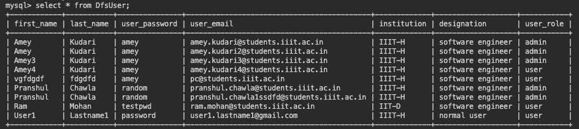
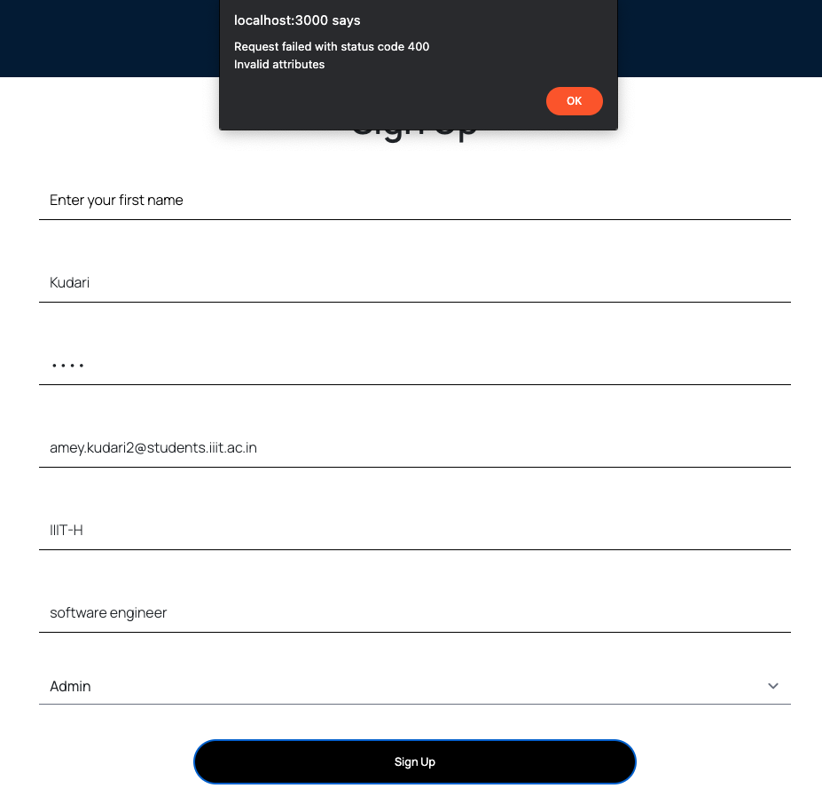

## Week 1 progress

## Requirements Step

Working on the files:
- `token.js`
- `create_schema.sql`
- `dump_v2.sql`
Users and tokens are being loaded using the hardcoded code stored in users.json and tokens.json. Changing from loading from these json files to loading from tables (by executing sql query).

## Design Step
- Tech stack being used: `NodeJs , MySql`
- Changing the schema and adding DfsUser table into the database and adding the sample values into it.
- Creating the relevant dump file (dump_v2.sql) for other users to add other the new table sample values

## Build Step
- Write now the user data is stored in a json file on registration and data is fetched from this file, so the first task is to migrate this data into the database by creating a new table for this `DfsUser`.
- Secondly the registration API has to be modified to insert the users to this table rather than file.
- Return appropriate response when registration API is called :
    * Error codes (400,409) when not inserted, in case of duplicate email id or missing fields
    * Success code (200) if inserted

- Files changed: https://github.com/AmitPandey-Research/dfs-backend/blob/master/routes/auth/token.js

- PR : https://github.com/AmitPandey-Research/dfs-backend/pull/6

- Issue : https://github.com/AmitPandey-Research/dfs-backend/issues/4

## Schema and Test Data

## Testing Step (Sign Up)

- User already exists

- Missing field

- Successfully inserted

* Here the user is inserted into the database and a success message is shown, as can be seen in database :

