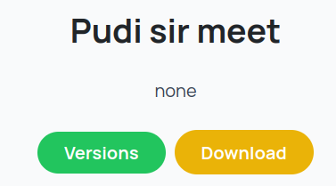
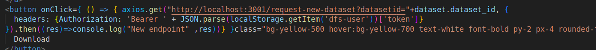
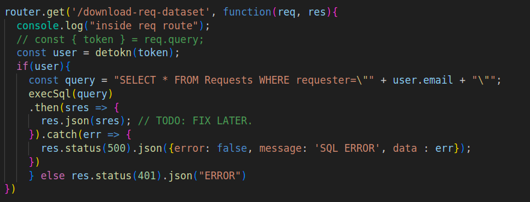

## Week 1 progress
<!-- # Week X -->

***

## Identification Step

The download requirement functionality of the web app is not implemented. There are two kinds of datasets. Private and Public. To download a private dataset, a user has to request download access from the author of the dataset. However, he can download the dataset directly if that dataset is public.Also if he is the author of the dataset, he doesn't require permission to download a dataset.

***

## Requirements Step

*** 

## Functional Requirements: 
* Download Button on public dataset section.

* Download Button on 

## Design Step

***
Tech Stacks Used : `Reactjs`, `ExpressJs`, `NodeJs`.
* Created API end points to send user requests to the backend server.
* Created onClick function that sends get request to the backend.
* Files Changed : `Domain.js (Frontend)`, `Index.js( Backend)`.
* Frontend button implementation.

* Backend function implementation

## Build Step
To start backend server 
* On the backend Database is queried to find the required files or to display the corresponding errors.
* If a dataset is found there can be two cases
    * If the user is the owner of the database then the dataset file can be downloaded straightaway.
    * In case of a private dataset an additional query has to be done on the USER Database (this store information related to download requests). If the author has approved the download request then file will be sent to be downloaded otherwise pending request message will be sent.
***

## Testing Step

* Several corner cases has to be checked in this phase this includes
    * Displaying error when the queried database is empty.
    * If dataset is private then checking whether the owner has granted permission or not and whether the corresponding error is displayed.
    * Checking whether the current user is able to download the dataset directly without requiring a request.
***

## Current Work

* Set Usage Agreement:
    * 2 possible cases, (only one of the params will be given). in both cases, body of the post request will contain a long text. update on backend with long text.[Backend].
* Upload model page based on latest changes [Frontend].
***

<!-- *** -->

